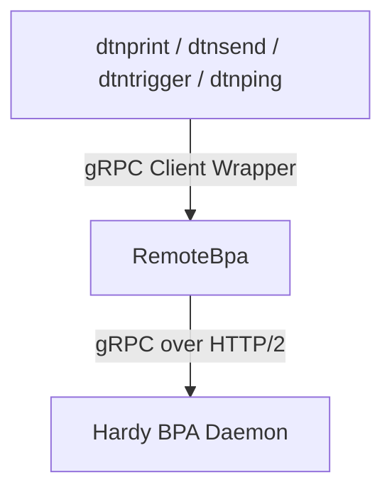

# System Architecture & Data Flow

This document outlines the core architecture and registration patterns of the `dtn-hdy-utils` tools and how they interact with the Hardy BPA.

## Integration & Network Layer
Both utilities communicate with the local `hardy` BPA instance using the gRPC services defined in the Hardy proto definitions (see [service.proto](../../hardy/proto/service.proto) for details). Communication is routed through the gRPC client wrapper `RemoteBpa` provided by the `hardy-proto` crate.

## Binary Architectures

### 1. The Receiver Utility (`dtnprint`)
- Registers an endpoint service with the BPA asynchronously by implementing the low-level `BpaService` trait from the `hardy-bpa` crate.
- By using `register_service`, it receives raw CBOR bundles directly from the BPA, enabling verification of BPSec Block Integrity Blocks (BIB).
- The `on_receive` handler verifies signatures against the local keystore, enforces policy (`strict`, `warn`, or `ignore`), formats the payload, and outputs it atomically to `stdout`.

### 2. The Sender Utility (`dtnsend`)
- Establishes a transient stream connection to the BPA by implementing the `Cla` trait and registering dynamically as a convergence layer adapter (CLA) over gRPC. See the definition of `SenderCla` and its registration in [dtnsend.rs](../src/bin/dtnsend.rs).
- Constructs the raw Bundle Protocol version 7 (BPv7) bundle locally using the `hardy-bpv7` builder API, specifying any desired source EID.
- Applies BPSec BIB HMAC-SHA256 signatures locally if signing keys are provided.
- Calls `Cla::Sink::dispatch` to inject the raw bundle bytes directly into the BPA's ingress pipeline. Because the bundle arrives via a CLA (simulating network ingress), the BPA bypasses the local service source EID spoofing checks, allowing loopback and echo testing scenarios.
- **Dry-run Mode (`-D`)**: Does not connect to the network. Instead, it utilizes the builder and timestamp abstractions in the `hardy-bpv7` library to construct the bundle local structure, serialize it to CBOR, and print it to stdout.

### 3. The Query Utility (`dtnquery`)
- Interacts with the node storage offline by directly reading from the SQLite metadata database (`metadata.db`) or PostgreSQL database.
- Parsed configurations are loaded dynamically to extract configured `node-ids` and determine the active storage backend.
- Computes pending/waiting bundle structures and outputs offline stats mirroring the `dtn7-rs` `dtnquery` interface. For details, see [dtnquery.rs](../src/bin/dtnquery.rs).

### 4. The Trigger Utility (`dtntrigger`)
- Registers an endpoint service dynamically on the running Hardy BPA daemon using `register_service` to receive raw CBOR bundles.
- Verifies BPSec signatures on incoming bundles according to the configured keystore and verify policy.
- Listens to incoming bundle payloads:
  - If `--print` is enabled, formats the incoming payload inline to stdout.
  - Otherwise, writes the payload bytes safely to a named temporary file (`tempfile::NamedTempFile`) and spawns a background command, passing `<source_eid>` and `<temp_file_path>` as parameters, cleaning up the temp file automatically upon process exit. For details, see [dtntrigger.rs](../src/bin/dtntrigger.rs).

### 5. The Ping Utility (`dtnping`)
- Connects as a client to the running local Hardy BPA instance via gRPC using `RemoteBpa`.
- Registers itself as a service using `register_service` (dynamically generating a client-side ephemeral service EID like `dtnping-<pid>` if no custom source EID is specified via `-S`).
- Builds ping bundles locally, optionally signing them with HMAC-SHA256, and dispatches them via `ServiceSink::send`.
- Performs signature verification on incoming ping reply bundles (pongs) in `on_receive`.
- Tracks RTTs locally and prints progress and final statistics. Status reports are parsed to show routing path transitions in real time. For details, see [dtnping.rs](../src/bin/dtnping.rs).

