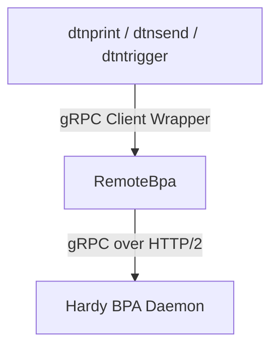

# System Architecture & Data Flow

This document outlines the core architecture and registration patterns of the `dtn-hdy-utils` tools and how they interact with the Hardy BPA.

## Integration & Network Layer
Both utilities communicate with the local `hardy` BPA instance using the gRPC services defined in the Hardy proto definitions (see [service.proto](../../hardy/proto/service.proto) for details). Communication is routed through the gRPC client wrapper `RemoteBpa` provided by the `hardy-proto` crate.

## Binary Architectures

### 1. The Receiver Utility (`dtnprint`)
- Registers an endpoint application with the BPA asynchronously by implementing the high-level `Application` trait from the `hardy-bpa` crate.
- See the definition of `PrintApp` and its implementation of `Application` in [dtnprint.rs:L31-L74](../src/bin/dtnprint.rs#L31-L74).
- The `on_receive` handler in [dtnprint.rs:L47-L60](../src/bin/dtnprint.rs#L47-L60) handles formatting and outputs textual payload content to `stdout` atomically.

### 2. The Sender Utility (`dtnsend`)
- Establishes a transient stream connection to the BPA by implementing the `Cla` trait and registering dynamically as a convergence layer adapter (CLA) over gRPC. See the definition of `SenderCla` and its registration in [dtnsend.rs:L51-L74](../src/bin/dtnsend.rs#L51-L74).
- Construct the raw Bundle Protocol version 7 (BPv7) bundle locally using the `hardy-bpv7` builder API, specifying any desired source EID.
- Calls `Cla::Sink::dispatch` to inject the raw bundle bytes directly into the BPA's ingress pipeline. Because the bundle arrives via a CLA (simulating network ingress), the BPA bypasses the local service source EID spoofing checks, allowing loopback and echo testing scenarios.
- **Dry-run Mode (`-D`)**: Does not connect to the network. Instead, it utilizes the builder and timestamp abstractions in the `hardy-bpv7` library to construct the bundle local structure, serialize it to CBOR, and print it to stdout. For implementation details, refer to [dtnsend.rs:L100-L122](../src/bin/dtnsend.rs#L100-L122).

### 3. The Query Utility (`dtnquery`)
- Interacts with the node storage offline by directly reading from the SQLite metadata database (`metadata.db`) or PostgreSQL database.
- Parsed configurations are loaded dynamically to extract configured `node-ids` and determine the active storage backend.
- Computes pending/waiting bundle structures and outputs offline stats mirroring the `dtn7-rs` `dtnquery` interface. For details, see [dtnquery.rs](../src/bin/dtnquery.rs).

### 4. The Trigger Utility (`dtntrigger`)
- Registers an endpoint application dynamically on the running Hardy BPA daemon using gRPC streams.
- Listens to incoming bundle payloads:
  - If `--print` is enabled, formats the incoming payload inline to stdout.
  - Otherwise, writes the payload bytes safely to a named temporary file (`tempfile::NamedTempFile`) and spawns a background command, passing `<source_eid>` and `<temp_file_path>` as parameters, cleaning up the temp file automatically upon process exit. For details, see [dtntrigger.rs](../src/bin/dtntrigger.rs).
